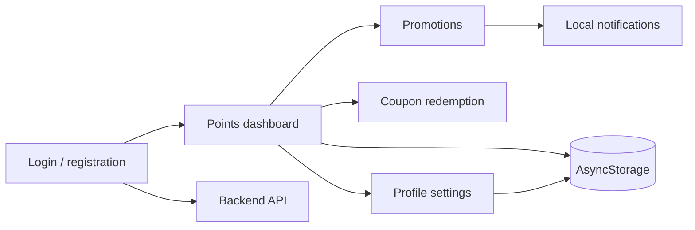

<div align="center">

# Fuel Rewards Mobile App

**React Native / Expo loyalty-app prototype for a fuel-station customer experience.**

Authentication, points, promotions, coupon redemption, notifications, profile settings, and bilingual ES/EN UI in a mobile-first application.


</div>

## What It Does

The app models a customer loyalty flow for a fuel-station brand:

- register and sign in against a backend API;
- keep the active profile on-device with AsyncStorage;
- view accumulated points and a personal customer code;
- browse promotions and point requirements;
- redeem eligible coupons and generate redemption codes;
- receive local notifications when new promotions are detected;
- update profile information and profile picture;
- switch between Spanish and English;
- navigate through native stack/tab screens.

The project is a prototype and is **not an official Shell application**.

## Mobile Flow



## App Structure

| Area | Implementation |
| --- | --- |
| Mobile UI | React Native + Expo |
| Navigation | React Navigation stack + bottom tabs |
| Authentication | Backend login/register API boundary |
| Local state | AsyncStorage |
| Promotions | API-backed with local fallback data |
| Coupon flow | Points validation + generated redemption codes |
| Notifications | Expo Notifications |
| Profile media | Expo Image Picker |
| Localization | Spanish / English translation layer |

## Tech Stack

`React Native` `Expo` `TypeScript` `React Navigation` `AsyncStorage` `Expo Notifications` `Expo Image Picker`

## Running the App

```bash
npm install
npm start
```

Then launch through Expo on the target platform:

```bash
npm run android
npm run ios
npm run web
```

The client resolves its backend URL from `EXPO_PUBLIC_API_URL` when configured and otherwise uses development host defaults.

## Main Screens

The source contains dedicated screens for:

- Login
- Registration
- Home / points dashboard
- Promotions
- Coupon exchange
- Account settings

The public repository currently documents the implementation from source; product screenshots can be added separately from a real device run.

## Scope

This project demonstrates mobile application structure and customer-loyalty workflows. Promotion and coupon data includes prototype/demo content, and the repository should not be interpreted as a connection to Shell production systems.
